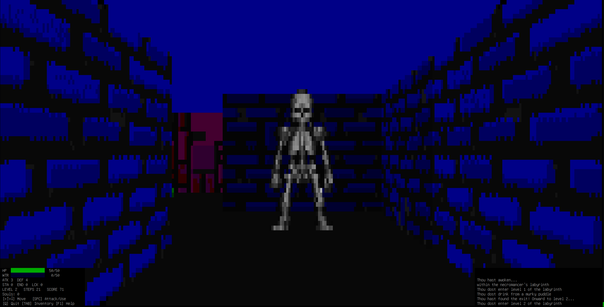

# maze3d — 2.5D Terminal Raycaster



by **oli4vr**


A demo project exploring the capabilities of the modern terminal emulator:
procedural texture generation, DDA raycasting, billboard sprites, and
full-screen real-time animation — all rendered with Unicode block
characters and xterm-256 colour in a standard terminal window.

## Prerequisites

- **libncursesw** — the wide-character ncurses library (for Unicode support)

  **Debian/Ubuntu:**
  ```sh
  sudo apt install libncursesw6 libncursesw-dev
  ```

  **Fedora/RHEL:**
  ```sh
  sudo dnf install ncurses ncurses-devel
  ```

  **Arch Linux:**
  ```sh
  sudo pacman -S ncurses
  ```

  **macOS (Homebrew):**
  ```sh
  brew install ncurses
  ```

- A terminal emulator that supports **256 colours** and **UTF-8**.
  Most modern terminals (GNOME Terminal, kitty, Alacritty, iTerm2,
  Windows Terminal, xterm-256color) work out of the box.

## Build

```sh
make          # compiles maze3d
make clean    # removes object files and binaries
make install  # installs maze3d to /usr/bin/maze3d (may need sudo)
make uninstall # removes /usr/bin/maze3d
```

No configure step is needed.  The Makefile uses `pkg-config` to find
the ncursesw include path and link flags automatically.  Use
`DESTDIR=/some/path make install` for staged installations.

## Run

```
./maze3d          interactive game
./maze3d --demo   auto-pilot screensaver demo
```

Maze generation takes ~2 seconds at startup.  Press **Q** to quit.

---

## maze3d — Simple 3D Maze Survival Game

Navigate a procedurally generated 512×512 maze inside a necromancer's
mind.  Defeat the necromancer at level 40 to break free from his
prison.  Collect water and potions to survive, kill enemies for souls,
and spend souls on stat upgrades.

### Controls

| Key          | Action                                      |
|--------------|---------------------------------------------|
| Arrow Up     | Move forward one block                      |
| Arrow Down   | Move backward one block                     |
| Arrow Left   | Turn 90° left                               |
| Arrow Right  | Turn 90° right                              |
| Space        | Attack enemy in front / use item at feet / exit through skull wall |
| TAB          | Open inventory / stat upgrade menu          |
| H            | Show high scores                            |
| F1 / ?       | Help screen                                 |
| Q            | Quit                                        |

Moves and attacks play a ~250-350ms animation (22 frames at 16ms).
The next input can be queued during playback for responsive control.

### Gameplay

- **Health** depletes when you have no water (2 HP/step).
- **Water** is consumed only when moving forward/backward (3 units).
  Find blue puddles and water bottles to replenish.
- **Skeletons**, **orcs**, and **cultists** block your path.  Attack
  with Space to defeat them and collect souls.
- **Souls** (escalating cost starting at 5) can be spent to upgrade 6 stats: ATK, DEF, TGH, STA,
  END, LCK. Each upgrade costs 1 more soul than the last.
- **Enemies** have a 25% chance to drop a potion or water bottle
  (50/50 split).
- **Exit** through a skull-decorated wall to reach the next level.
- **Necromancer boss** awaits at level 40 with high stats.
- **High scores** (5 entries) saved to `~/.maze3d/maze3d.keep`.

---

## maze3d --demo — Auto-Pilot Screensaver

An auto-pilot mode that wanders the maze autonomously, demonstrating
the engine's rendering capabilities without user input.  Functions
as a terminal screensaver — press **Q** to quit.

Run with `./maze3d --demo`.

---

## Technical Architecture

### Source files

| File             | Role                                         |
|------------------|----------------------------------------------|
| `engine.h`       | Public types, constants, engine API          |
| `engine.c`       | DDA raycasting renderer, sprite projection   |
| `gentex.h`       | Procedural texture generation API            |
| `gentex.c`       | Procedural stone/brick texture + sprite gen  |
| `maze3d.c`       | Interactive game + auto-pilot demo --demo    |
| `maze3d-text.c`  | Text-based debug mode --text                 |
| `gameplay.h`     | RPG stats, combat, items, log, high scores   |
| `gameplay.c`     | Gameplay logic, enemy AI, maze gen           |
| `progression.h`  | Tunable balance values                       |
| `enemies.h`      | Enemy type enum, names, sprite data          |
| `enemies.c`      | Enemy sprite images and definitions          |

### Rendering

- **DDA raycasting** — one ray per screen column, step through a
  grid-aligned Digital Differential Analyzer until a wall is hit.
  Perpendicular distance eliminates fisheye distortion.
- **5 shade levels** — Unicode block characters (`█` to ` `) for
  distance-based dimming.
- **xterm-256 colour** — every pixel is quantised to the nearest
  6×6×6 colour cube or grey ramp entry.
- **Billboard sprites** — skeleton, potion, and water sprites are
  projected as camera-facing billboards with z-ordering and wall
  occlusion.

### Maze generation

1. The map is filled with 8×8 zones of random colour/texture/style.
2. A random-walk algorithm carves corridors from the centre outward.
3. Items and enemies are scattered across empty cells.
4. The cell farthest from centre becomes a skull-wall exit.

### Texture system

- **40 wall textures**: 4 colour themes × 2 styles (stone/brick) × 5
  variations (4 normal + 1 with embedded skull).
- **Procedural generation**: blocks are placed greedily on an 8×8
  segment grid with randomised shapes, corner rounding, shadow/bevel
  shading, and palette quantisation.
- **Brick textures** use a deterministic seam hash so the 5 variations
  share the same mortar pattern at the wrap point.
- **Sprites** are generated from embedded alpha-masked templates.
